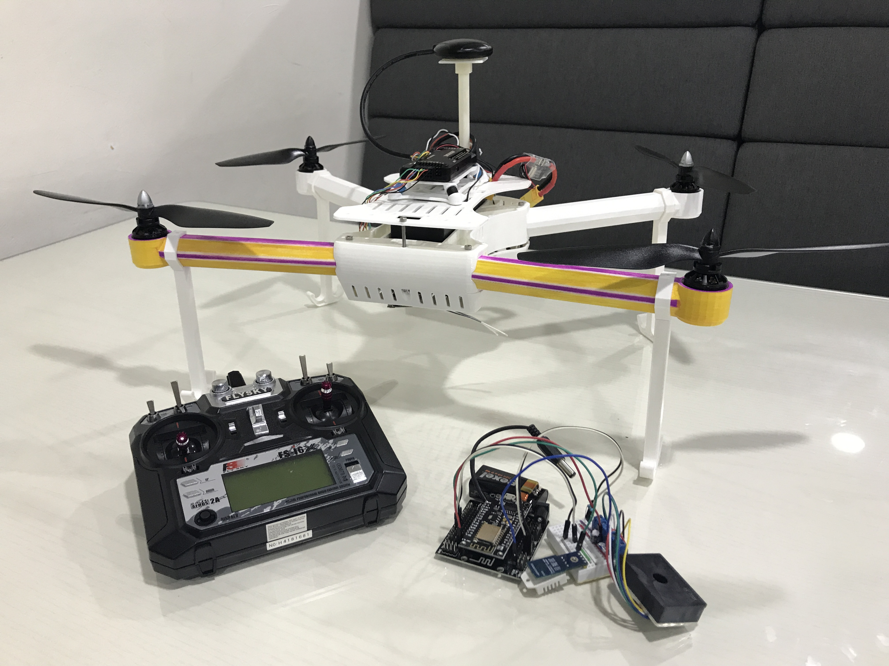
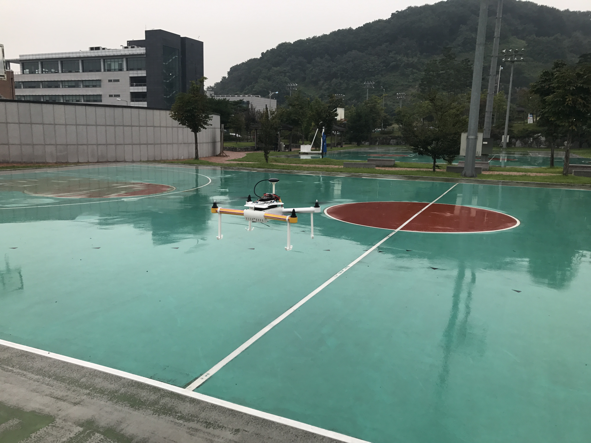
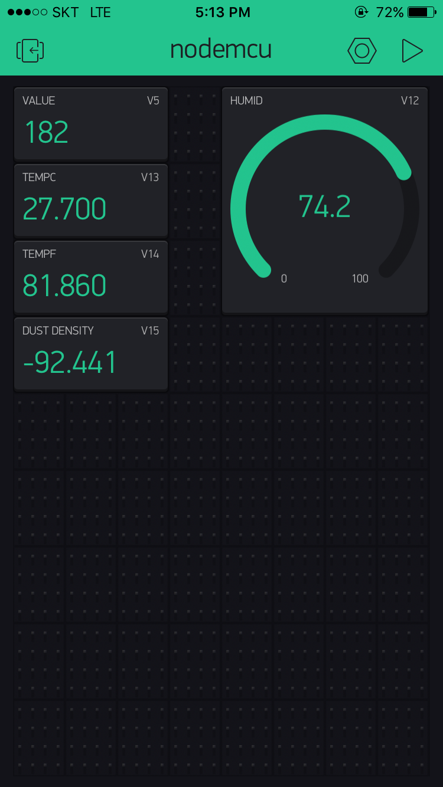

# DK daidalos

drone project at DK3 Dream Program (07.17 - 10.17)

> Drone

exterior design inspired from [thingiverse](https://www.thingiverse.com/thing:261298)

made with 3D printer (material: FDM, printing time: 48hr)

- Purpose

Climate measurement drone with cheap price due to using 3D printer

easy to manage, retain.

good durability compared to same price commercial products.

- Spec

CPU: Fixhawk Flight Controller PX4

Telemetry: 3DR Radio set for Pixhawk Auto Pilot

Motor: EMAX MT-2216 KV810 Brushless Motor * 4EA.

Controller: Flysky fs-i6x

 

> Measure device

- role

measure temperature, humidity, dust density on drone
send the result to Phone App [Blynk](https://www.blynk.cc/)
with WiFi(ESP8266)

- Spec

Board: ESP8266 NodeMCU

Temp/Humid sensor: DHT22 PCB module AM2302

Dust sensor: GP2Y1014AU0F

> Image

